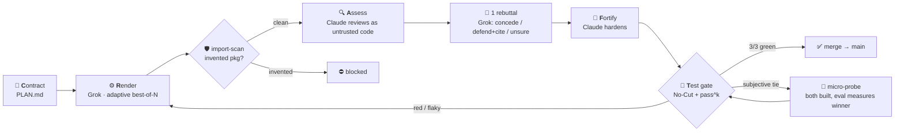

<div align="center">

# 🤝 Dual-Agent CRAFT Harness

### Two rival AI models. One referee that can't be argued with.

A local build harness where **Claude Code** (architect/reviewer) and **Grok CLI** (builder) collaborate across vendor lines — and an **objective `pass^k` eval**, never their agreement, decides what ships.


</div>

---

## ✨ Why this is different

Most agent setups are **single-vendor**: one model builds *and* judges its own work — so it inherits its own blind spots and [prefers its own output](https://arxiv.org/pdf/2404.13076). This harness is built on the opposite bet, which the research independently converged on (["SLEAN", arXiv:2510.10010](https://arxiv.org/pdf/2510.10010)):

> **Two *different* model families produce and cross-examine each other, and a deterministic eval — not consensus — is the arbiter.**

| | Single-vendor fleets (e.g. 67 agents) | **This harness** |
|---|---|---|
| Reviewer vs builder | same model family → correlated errors | **different vendors** → uncorrelated errors |
| Who decides a merge | the agents "agree" | the **`pass^k` eval** (all K runs green) |
| Disagreement | a problem to negotiate away | **signal** — the whole point |
| Hallucinated packages | caught by eyeball, maybe | **blocked deterministically** (registry 404 + slopsquat age-check) |
| Cost of "ultimate" | 60+ agents to maintain | **6 small roles + an eval** |

The research is blunt about why "debate until you agree" is the wrong design: multi-round debate produces [**sycophantic false consensus**](https://arxiv.org/abs/2509.05396) and [self-correction without an external signal degrades accuracy](https://arxiv.org/abs/2310.01798). So here, agents cross-examine **once**, then the test suite settles it.

---

## 🔁 The CRAFT loop



**The flow, in one breath:** Claude writes a strict `PLAN.md` → Grok builds N variants in an isolated git worktree → a deterministic scan blocks invented dependencies → Claude reviews the diff as *untrusted external code* → Grok gets exactly **one** rebuttal → the `pass^k` gate merges only if every run is green. Conflict = abort, never overwrite. Red = no merge.

---

## 🛡️ Anti-drift & anti-hallucination guards

Every guard is **deterministic** where possible (nothing in the loop that can itself hallucinate):

| Guard | What it stops | How |
|---|---|---|
| **`import-scan`** | invented packages ([~19.7% of LLM pkg suggestions don't exist](https://arxiv.org/abs/2406.10279)) | live PyPI/npm `404` + PLAN allow-list, **fail-closed, zero tokens** |
| **slopsquat tier** | *registered* hallucinated names ([slopsquatting](https://www.aikido.dev/blog/slopsquatting-ai-package-hallucination-attacks)) | package **age check** — young + unexpected = flagged |
| **abstention schema** | the builder bluffing a defense | `defend` needs a real citation, else auto-downgrades to **`unsure`** |
| **untrusted-code review** | drift from the contract | Claude reviews Grok's diff as hostile input, file-by-file |
| **`pass^k` gate** | flaky "green once" merges ([τ-bench: pass@1 ≫ pass@8](https://arxiv.org/abs/2406.12045)) | all K runs must pass — consistency, not luck |
| **No-Cut merge** | silent overwrites / false "done" | git conflict = abort; red verify = block |
| **`test-guard`** | the builder gaming the gate by editing tests (invariant 7) | deterministic diff scan for test/verify files, **fail-closed, zero tokens** |
| **least-privilege Grok** | destructive autonomous tools | `--deny` overrides `--always-approve` |
| **decorrelation log** | the moat quietly dying | warns if the two vendors stop disagreeing |

---

## ⚡ Token efficiency (without losing quality)

Every saving is **quality-preserving** — proven, not assumed:

- **Lossless eval early-stop** — `pass^k` is an AND; one red ends it. Saves up to `(K-1)/K` verify runs, **bit-identical verdict**.
- **Adaptive N** — render `N=1` first, escalate to `best-of-N` only on a failed acceptance check. *(Live test: saved 2 of 3 variants on the first try.)*
- **Prompt-cache flag** — `--exclude-dynamic-system-prompt-sections` makes the ~100k system prefix cache-shareable across worktrees.
- **Diff-only rebuttal** — the builder only re-reads the flagged files (~50% fewer tokens).
- **Zero-quota scout** — offload best-of-N exploration to a local **Ollama** model; only the decisive review stays frontier.
- **Budget guard** — fail `BLOCKED` *before* the credit pool is exhausted, never silently mid-merge.

---

## 🚀 Quickstart (Linux / macOS — bash)

> **Prereqs:** bash 5.x, `git`, `python3`, `curl`, [`claude`](https://claude.com/claude-code) + [`grok`](https://x.ai) CLIs (each on its own subscription — **no API keys**), optional [`codex`](https://github.com/openai/codex) as a sandboxed 3rd vendor and [`ollama`](https://ollama.com) for the local scout.

```bash
# 1. C — write the contract (Claude fills PLAN.template.md)
cp PLAN.template.md PLAN.md          # ...fill in problem, interface, acceptance, tests...

# 2. R — Grok builds, cheaply first then escalates if needed
./dual-build.sh --adaptive --variants 3 --verify "python3 -m pytest -q"

# 3. guards — block invented deps + test-file tampering (both deterministic, zero tokens)
./lib/import-scan.sh --poc feat/poc --base main --check-provenance
./lib/test-guard.sh  --poc feat/poc --base main

# 4. A — cross-vendor bounded review (Claude assess + 1 Grok rebuttal)
./dual-review.sh --poc feat/poc --base main

# 4b. subjective tie? -> measure, don't argue (invariant 8)
./dual-tiebreak.sh --verify "python3 -m pytest -q" \
    --approach-a "lookup table" --approach-b "iterative compute"

# 5. T — merge ONLY if pass^k is green (and the builder didn't touch tests)
./dual-merge.sh --from feat/poc --into main --verify "python3 -m pytest -q" --eval-k 5 --test-guard
```

Split-screen cockpit (tmux, watch both agents live): `./dual-view.sh`
Run the deterministic test suite (66 tests, offline): `tests/run.sh`

<details>
<summary><b>Windows (PowerShell 5.1) — original, preserved</b></summary>

The live-verified Windows variant lives unchanged in <code>powershell/</code>:

```powershell
.\powershell\dual-build.ps1 -Adaptive -Variants 3 -Verify "py -3 test_yourfeature.py"
.\powershell\lib\import-scan.ps1 -PocBranch feat/poc -Base main -CheckProvenance
.\powershell\dual-review.ps1 -PocBranch feat/poc -Base main
.\powershell\dual-merge.ps1 -From feat/poc -Into main -Verify "py -3 test_yourfeature.py" -EvalK 5
```
</details>

---

## 🧩 Components

```
dual-agent-craft/
├─ PLAN.template.md      📝 the contract template (the single shared truth)
├─ PROTOCOL.md          📜 8 coordination invariants (eval decides, 1 writer/space, …)
├─ AGENTS.md            🤝 vendor-neutral builder contract (read by Grok/Codex/Cursor/…)
├─ ADAPTERS.md          🔌 how to plug in a 3rd/4th model
├─ dual-build.sh        ⚙️  Render: Grok in an isolated worktree, adaptive-N
├─ dual-review.sh       💬 Assess: bounded cross-review, eval decides
├─ dual-merge.sh        🧪 No-Cut + pass^k merge gate (--test-guard hook)
├─ dual-tiebreak.sh     🎲 invariant-8 micro-probe: build both, MEASURE the winner
├─ dual-view.sh         🖥️  tmux split-screen cockpit
├─ lib/
│  ├─ common.sh         shared helpers (python3-JSON, curl, locale-neutral)
│  ├─ grok-call.sh      clean headless Grok wrapper (stdout/stderr OS-separated)
│  ├─ claude-call.sh    clean headless Claude wrapper (+ cost telemetry)
│  ├─ codex-call.sh     Codex 3rd vendor (real -s sandbox on Linux, -o clean result)
│  ├─ local-call.sh     zero-quota Ollama scout
│  ├─ eval-harness.sh   pass@k / pass^k scorer (lossless early-stop)
│  ├─ import-scan.sh    deterministic invented-package gate
│  ├─ test-guard.sh     deterministic invariant-7 gate (builder can't edit tests)
│  ├─ budget-guard.sh   fail BLOCKED before credit exhaustion
│  └─ decorrelation.sh  cross-vendor moat telemetry
├─ tests/               🧪 49 offline bats tests (guards, gate invariants, adapters)
└─ powershell/          🪟 the original, live-verified Windows PS-5.1 variant
```

---

## 🔬 Research foundation

This isn't vibes — every core decision is anchored to a source:

- **Cross-vendor diversity** beats self-review · [Mixture-of-Agents](https://arxiv.org/abs/2406.04692) · [Replacing Judges with Juries](https://arxiv.org/abs/2404.18796) · [self-preference bias](https://arxiv.org/pdf/2404.13076)
- **Eval decides, not debate** · [LLMs Cannot Self-Correct (ICLR'24)](https://arxiv.org/abs/2310.01798) · [Talk Isn't Always Cheap](https://arxiv.org/abs/2509.05396)
- **`pass^k` reliability** · [τ-bench](https://arxiv.org/abs/2406.12045) · **package hallucination** · [arXiv:2406.10279](https://arxiv.org/abs/2406.10279)
- **The pattern itself** · [SLEAN: independent → cross-critique → arbitration](https://arxiv.org/pdf/2510.10010)

---

## ⚖️ Honest limitations

- `--sandbox` for Grok is **macOS-only** today; compensated by worktree isolation + `--deny` + least-privilege. On Linux, **Codex's `-s read-only|workspace-write` is a real local sandbox** — use `lib/codex-call.sh` where sandboxing matters.
- The local Ollama scout is for **exploration only** — never the merge-gating review (the moat needs a strong, different-vendor reviewer).
- The bash harness is tested on **Linux (bash 5.x)**; macOS should work but is unverified. The original **Windows / PowerShell 5.1** variant is preserved in `powershell/` (live-verified 2026-06).
- The deterministic suite (66 bats tests) covers guards, gate invariants and adapter contracts with stubbed CLIs; the *model-quality* of builds is still gated live by `pass^k`, not by unit tests.
- `ledger/SPEND.jsonl` (budget telemetry) is a plain, unsigned file that code running during `--verify` could locate via `git rev-parse --git-common-dir` and tamper with — the budget guard is a *cost-control convenience*, not a security boundary. Treat verify-time code as trusted or move the ledger outside any git tree.

---

<div align="center">

**Built with the loop it implements** — researched by parallel agents, cross-examined by Claude + Grok, gated by the eval.

*No API keys. No cloud. No single point of judgment.*

</div>
