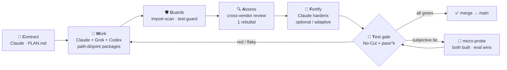

<div align="center">

# 🤝 Dual-Agent CRAFT Harness

### Three AI workers. One referee that can't be argued with.

A local build harness where **Claude Code**, **Grok CLI**, and **Codex** collaborate as a **team** — and an **objective `pass^k` eval**, never their agreement, decides what ships.


</div>

---

## ✨ Why this is different

Most agent setups are **single-vendor**: one model builds *and* judges its own work — so it inherits its own blind spots and [prefers its own output](https://arxiv.org/pdf/2404.13076). This harness is built on the opposite bet ([SLEAN, arXiv:2510.10010](https://arxiv.org/pdf/2510.10010)):

> **Different model families produce and cross-examine each other, and a deterministic eval — not consensus — is the arbiter.**

| | Single-vendor fleets | **This harness** |
|---|---|---|
| Who builds | one model | **Claude + Grok + Codex** (path-disjoint packages) |
| Reviewer vs builder | same family → correlated errors | **cross-vendor moat** (assessor ≠ builder) |
| Who decides a merge | agents “agree” | **`pass^k` eval** (all K runs green) |
| Architect role | pure management | **Claude plans *and* codes** (no pure manager) |
| Hallucinated packages | maybe eyeballed | **blocked deterministically** (registry + allow-list) |
| Cost of “ultimate” | dozens of agents | **small role graph + gates + one orchestrator** |

Research is blunt about why “debate until you agree” is wrong: multi-round debate produces [sycophantic false consensus](https://arxiv.org/abs/2509.05396). Here, agents cross-examine **once**, then the test suite settles it.

---

## 🔁 The loop today: C → W → G → A → [F] → T



**In one breath:** Claude writes a strict `PLAN.md` → the **team dispatcher** splits work so **Claude, Grok, and Codex all implement** path-disjoint packages → deterministic guards block invented deps and test tampering → cross-vendor review (1 rebuttal) → optional fortify → merge **only** if `pass^k` is green. Conflict = abort. Red = no merge.

One-command entrypoint: **`./dual-run.sh`**.

---

## 👥 Who does what (team, not pure pipeline)

| Function | Default | Notes |
|---|---|---|
| **Architect** | Claude | Writes `PLAN.md` — then **also takes work packages** |
| **Workers** | Claude, Grok, Codex | Assigned via `lib/team-dispatch.sh` → `ledger/WORK.json` |
| **Assessor** | Claude (or Codex) | Must differ from builder vendor (moat) |
| **Rebutter** | = builder of the POC | Exactly **one** round |
| **Guards / arbiter** | Gate (scripts + eval) | Never a model opinion |
| **Scout** (optional) | Ollama | $0 first pass — never merge-gating |

**Adaptive profiles** (`config/roles.json` + `lib/role-router.sh`):  
`minimal` · `standard` · `thorough` · `security` · `sandbox`  
— chosen from task/PLAN signals (e.g. auth → codex builder + fortify).

```bash
./dual-run.sh --who --task "add OAuth payment"
./lib/role-router.sh profiles
./lib/team-dispatch.sh run --plan PLAN.md --dry-run   # roster without vendor calls
```

---

## 🛡️ Anti-drift & anti-hallucination guards

Every guard is **deterministic** where possible (nothing that can itself hallucinate):

| Guard | What it stops | How |
|---|---|---|
| **`import-scan`** | invented packages ([~19.7% LLM pkg suggestions](https://arxiv.org/abs/2406.10279)) | PyPI/npm `404` + PLAN allow-list, fail-closed |
| **slopsquat tier** | registered-but-young fakes | package age check |
| **`test-guard`** | builder editing tests (invariant 7) | diff scan, fail-closed |
| **ownership** | double-writes across workers | path-disjoint packages + never-list |
| **exclusive dual-run lock** | two dual-runs at once | `.dual-agent/dual-run.lock` |
| **baton** | out-of-turn work | `HANDOFF.md` + run-state |
| **`pass^k` gate** | flaky “green once” merges | all K runs green |
| **No-Cut merge** | silent overwrite | conflict = abort |
| **1-rebuttal + grounding** | endless debate / bluff defend | citation required or → `unsure` |
| **decorrelation log** | moat dying quietly | warns if vendors stop disagreeing |

---

## ⚡ Token efficiency (quality-preserving)

- **Lossless eval early-stop** — `pass^k` is AND; first red ends the loop  
- **Adaptive N** — `N=1` first, escalate only if acceptance fails  
- **Team packages** — parallel *logical* work, sequential integrate (safe git)  
- **Zero-quota scout** — optional Ollama first; frontier only when needed  
- **Budget guard** — block *before* spend, not mid-merge  

---

## 🖥️ Platforms (Linux · macOS · Windows)

| | Linux | macOS | Windows |
|---|---|---|---|
| Full team (`dual-run`, team-dispatch) | ✅ native bash 5 | ✅ Homebrew **bash 5** | ✅ Git Bash **or** WSL |
| Classic CRAFT scripts | ✅ | ✅ | ✅ bash **or** `powershell/*.ps1` |
| CI | ✅ ubuntu-latest | ✅ macos-latest | — (use bash path locally) |
| Cockpit | tmux / HTML dashboard | tmux / dashboard | Windows Terminal + dashboard |

Full matrix: **[`PLATFORM.md`](./PLATFORM.md)**.

```bash
# Linux
./dual-run.sh --status

# macOS (not system /bin/bash 3.2)
brew install bash git python3
/opt/homebrew/bin/bash ./dual-run.sh --status

# Windows PowerShell → Git Bash / WSL
.\powershell\dual-run.ps1 --status
.\powershell\dual-status.ps1
```

---

## 🚀 Quickstart

> **Prereqs:** bash **4.4+** (5.x preferred), `git`, `python3`, `curl`,  
> [`claude`](https://claude.com/claude-code) + [`grok`](https://x.ai) CLIs (own subscriptions — **no API keys**),  
> optional [`codex`](https://github.com/openai/codex), optional [`ollama`](https://ollama.com).

### One command (recommended)

```bash
cp PLAN.template.md PLAN.md    # fill contract — or use --auto-plan --task "…"

./dual-run.sh --who --task "your feature"          # adaptive who-does-what
./dual-run.sh --task "your feature" \
  --verify "python3 -m pytest -q"

# Useful flags
./dual-run.sh --dry-run --verify true --skip-merge # phase plan only
./dual-run.sh --profile security --verify "…"      # force profile
./dual-run.sh --no-team-work --verify "…"          # old mono-builder R path
./dual-dashboard.sh && xdg-open dashboard.html     # HTML cockpit
./dual-status.sh                                   # doctor
```

### Manual stages (same pipeline)

```bash
# C — contract
cp PLAN.template.md PLAN.md

# W — team work (all three code)
./lib/team-dispatch.sh run --plan PLAN.md

# or mono Render
./dual-build.sh --adaptive --variants 3 --verify "python3 -m pytest -q"

# G — guards
./lib/import-scan.sh --poc feat/poc --base main --check-provenance
./lib/test-guard.sh  --poc feat/poc --base main

# A — review
./dual-review.sh --poc feat/poc --base main

# T — merge
./dual-merge.sh --from feat/poc --into main \
  --verify "python3 -m pytest -q" --eval-k 5 --test-guard
```

Split-screen (tmux): `./dual-view.sh`  
Offline suite: `tests/run.sh` (**188** bats tests)

<details>
<summary><b>Windows — full team path + classic PowerShell CRAFT</b></summary>

```powershell
# Full team path (Git Bash / WSL under the hood)
.\powershell\dual-run.ps1 --dry-run --verify "true" --skip-merge
.\powershell\dual-run.ps1 --task "feature" --verify "py -3 -m pytest -q"
.\powershell\dual-status.ps1

# Classic CRAFT (PS 5.1, preserved)
.\powershell\dual-build.ps1 -Adaptive -Variants 3 -Verify "py -3 test_yourfeature.py"
.\powershell\dual-review.ps1 -PocBranch feat/poc -Base main
.\powershell\dual-merge.ps1 -From feat/poc -Into main -Verify "py -3 test_yourfeature.py" -EvalK 5
.\powershell\dual-view.ps1
```

</details>

---

## 🧩 Components

```
dual-agent-craft/
├─ PLAN.template.md / PROTOCOL.md / AGENTS.md / ADAPTERS.md / PLATFORM.md
├─ config/
│  ├─ coordination.json   # lock, baton, ownership defaults
│  ├─ roles.json          # adaptive who-does-what
│  └─ team-work.json      # package assign policy (all workers code)
├─ dual-run.sh            # 🏁 C→W→G→A→[F]→T orchestrator
├─ dual-build.sh          # mono Render (or --no-team-work path)
├─ dual-review.sh         # bounded cross-review
├─ dual-merge.sh          # No-Cut + pass^k
├─ dual-tiebreak.sh       # invariant-8 micro-probe
├─ dual-status.sh         # doctor
├─ dual-dashboard.sh      # → dashboard.html
├─ dual-view.sh           # tmux cockpit
├─ lib/
│  ├─ common.sh           # portable helpers (Linux/macOS/Git Bash)
│  ├─ coordination.sh     # baton, lock, ownership
│  ├─ role-router.sh      # adaptive assignment
│  ├─ team-dispatch.sh    # decompose → assign → execute (3 workers)
│  ├─ grok-call / claude-call / codex-call / local-call
│  ├─ eval-harness / import-scan / test-guard / budget-guard / decorrelation
├─ harness/               # MAIN operating layer (hooks, skills, teams, drills)
├─ tests/                 # 188 offline bats tests
├─ dashboard.html         # self-contained cockpit
└─ powershell/            # Windows bridges + classic PS CRAFT
```

### Main harness (`harness/`)

Always-on operating contract (installable into `~/.claude`):

| Piece | Role |
|---|---|
| `CONTRACT.md` / `REFLEXES.md` / `MUSCLE-MEMORY.md` | doctrine |
| `operations/` | permissions + fail-closed hooks |
| `skills/` | triage, audit, a11y, loop-runner, … |
| `teams/` | Claude+Grok+Codex roster |
| `bin/mutation-train.sh` | mutation testing for fail-closed guards |
| `bin/reflex-drill.sh` / `self-check.sh` | fitness gates |
| `install.sh` | dry-run by default |

```bash
harness/install.sh                            # dry-run
HARNESS_INSTALL_CONFIRM=1 harness/install.sh  # install
```

---

## 🔬 Research foundation

- **Cross-vendor diversity** · [Mixture-of-Agents](https://arxiv.org/abs/2406.04692) · [Juries over Judges](https://arxiv.org/abs/2404.18796) · [self-preference](https://arxiv.org/pdf/2404.13076)  
- **Eval decides, not debate** · [LLMs Cannot Self-Correct](https://arxiv.org/abs/2310.01798) · [Talk Isn't Always Cheap](https://arxiv.org/abs/2509.05396)  
- **`pass^k`** · [τ-bench](https://arxiv.org/abs/2406.12045) · **package hallucination** · [arXiv:2406.10279](https://arxiv.org/abs/2406.10279)  
- **Pattern** · [SLEAN](https://arxiv.org/pdf/2510.10010)

---

## ⚖️ Honest limitations

- Grok `--sandbox` is **macOS-only** upstream; elsewhere: worktree + `--deny`. On Linux, **Codex `-s`** is a real sandbox.  
- Ollama scout is **exploration only** — never merge-gating review.  
- macOS needs **Homebrew bash 5** (system `/bin/bash` 3.2 is too old).  
- Windows full team path = **Git Bash or WSL** (`powershell/dual-run.ps1`).  
- Offline suite covers guards/adapters with stubbed CLIs; **product quality** is still live-gated by `pass^k`.  
- `ledger/SPEND.jsonl` is not a security boundary — set `DUAL_AGENT_SPEND_FILE` outside the tree if needed.

---

## 🧪 Verify

```bash
tests/run.sh                  # full offline bats suite
./dual-run.sh --dry-run --verify true --skip-merge
./lib/coordination.sh validate
./lib/role-router.sh profiles
```

CI: **ubuntu-latest + macos-latest** (bash 5 on macOS runners).

---

<div align="center">

**Built with the loop it implements** — researched by parallel agents, executed by a three-vendor team, gated by the eval.

*No API keys. No cloud. No single point of judgment.*

</div>
